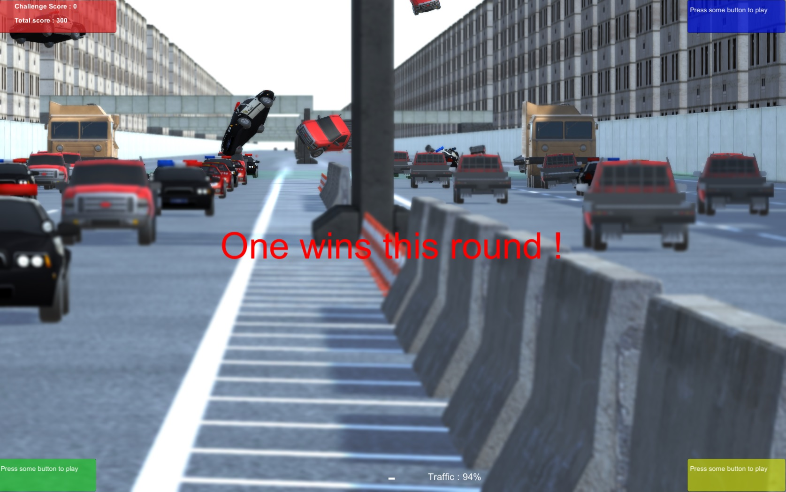

# What is this ?

Cartaclysm is a free and open source prototype. It is a game playable by 4 players on the same screen. The game is mainly multiplayer. You can play alone, but I think it will not be much interesting until a proper single player mode with goals and achievements is added, maybe one day.

# How to play ?

* [Download for Windows](https://github.com/oservieres/cartaclysm/releases/download/v0.0.2/cartaclysm-v0.0.2-windows.zip) (v0.0.2)
* [Download for OSX](https://github.com/oservieres/cartaclysm/releases/download/v0.0.2/cartaclysm-v0.0.2-osx.zip) (v0.0.2)
* Download for Linux coming soon

Controls:

| Action            | Keyboard    | Xbox 360 controller |
| ----------------- | ----------- | ------------------- |
| Accelerate        | Up arrow    | Right trigger       |
| Brake             | Down arrow  | Left trigger        |
| Turn right        | Right arrow | Left stick          |
| Turn left         | Left arrow  | Left stick          |
| Hover mode        | X           | X                   |
| Join game/respawn | Space       | A                   |

# What does it look like ?

# Known issues

It may be hard to quit the game: the pause menu is quite bugged. Do not hesitate to use `ALT + F4` or `CMD + Q`.
